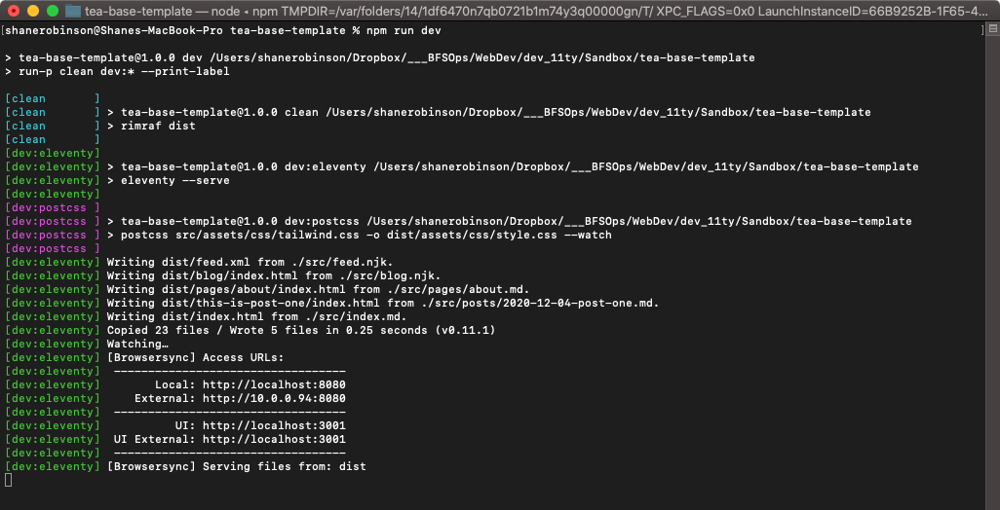

# tea-base-template

demo site: [teastack.netlify.app](https://teastack.netlify.app/)

This started out to be a most minimal TEAstack _(TailwindCSS, 11ty, AlpineJS)_ base template for testing and tutotials.

But it evolved into a more complicated, but also more refined, version of my #100DaysOfCode template.

Not everything is currently working that works in that project. But enough is working that this is a fully functional blog system and more than enough to get you started on your own #100DaysOfCode deployment and publishing.

## NOTE: This uses [TailwindCSS Typography plugin](https://github.com/tailwindlabs/tailwindcss-typography)

And while the plugin does a really nice job of setting attractive typography defaults, it really messes up image margins, padding, etc. IMHO... So much so that I find it impossible to use for a site containing image galleries, portfolios, etc. it's great if you're only publishing a text-based blog with a few inline images. If you want more control over your images, you'll probably need to completely remove the plugin from the `/tailwind.config.js` file and then reset your typography defaults in the `/src/assets/css/tailwind.css` file.

## Step 1. Clone It!

1. Click the **"Code"** button above, then click the clipboard icon to copy the repo URL
2. `cd` into your local **"Sites"** directory.
3. `git clone ` and immediately paste the repo URL you copied.
4. Hit **[RETURN]** key
5. The repo will be cloned to your **"Sites"** dir.
6. `cd tea-base-template`

## Step 2. Install

1. `npm install` to install all the new dependencies in your local repo.
2. `npm run dev` to start the 11ty dev server. If everything went well you should see something like the following:

3. _You use `control c` to stop the dev server._
4. `code .` will launch VSCode in that directory, ready to get to work!

## Step 3. Browse Local Dev Site

1. Notice the last few lines where it tells you the local URL to use to browse the local dev site:
   - `Local: http://localhost:8080`
2. Open your browser to [http://localhost:8080](http://localhost:8080) _(you should be able to click that link))_
3. You should see the **"Hello World"** index page.
4. Click around the local dev site.

## Step 4. Make Changes

The site files live in the `/src` directory.

1. Make text changes in the `/src/index.md` file, save the changes, and you should see the home page automatically update with your changes.
2. This is called **"hot reloading"** and it's built-in to 11ty when you're running in dev mode.
3. Open `/src/posts/2020-12-04-post-one.md` and make changes, save them, and the site will refresh in the browser automatically. If you haven't already, click **"Days"** in the Nav and click to the **"Post One"** post to see your changes. Make more changes and that post will update.
4. Same with the **"About"** page in `/src/pages/about.md`.

## Step 5. Add Your Data

11ty can use **Data** files to provide almost unlimited functionalities. One of the uses is to manage site-wide content.

1. In VSCode, open `/src/_data/meta.json` and you'll find some basic global site content. **META Content**.
2. Make changes, making sure to watch out for double quotes and commas, and you'll see those changes immediately _(if you're still running the dev server.)_
3. Take a look in the `/src/_data/social.json` file to see how the social icons in the footer are controled. Add your own information there. And if you don't have an account on a platform, just delete the URL value. When you save the file the icons in the footer will automatically update.

## Step 6. Create New Posts

You have some posts sitting in your Notes.app. This is just a testing project so you should create some new Posts in `/src/posts`.

1. Easiest way is to duplicate the existing post and change the filename and content.
2. You do NOT have to include the date in the filename... I do because the posts then automatically sort in the folder, with the newest one on top. It's not a big deal if you have 5 posts. But when you have hundreds of posts it gets very difficult when you want to edit a post to find it.
3. You'll also notice each post has a `date:` value in the frontmatter at the top. At the very least that should be set to the publish date. The time is not important. _(I use [TextExpander](https://textexpander.com/) and have a snippet that inserts the correctly formatted date for NOW when I create a new post.)_

## Step 7. Change About Page

1. In VSCode open `/src/pages/about.md` and change the content below the frontmatter to whatever you want.
2. If you don't want an **About Page** you can just delete the file.

## Step 8. Post Questions in Issues

Post any questions you have in the repo Issues. When you feel comfortable working on this test project, I'll provide instructions on how to clone it to a new repo. That new repo will be your REAL #100Days site. And at Netlify you'll point your current site setting to your new repo. It will be great practice and experience for you to know how to do that. Will also be good experience to delete junk repos on your Github and also delete the local repos.

## Good Luck!!
